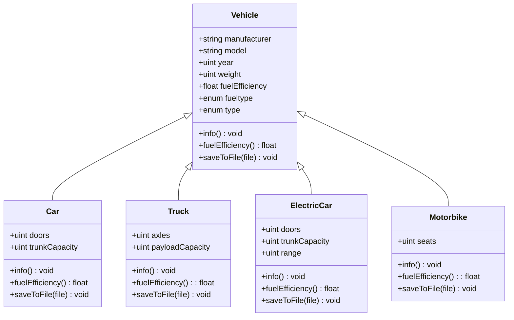
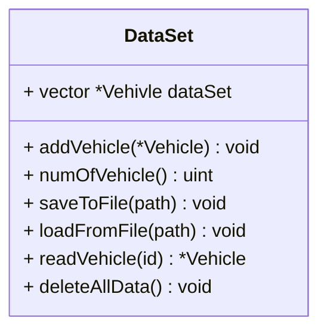
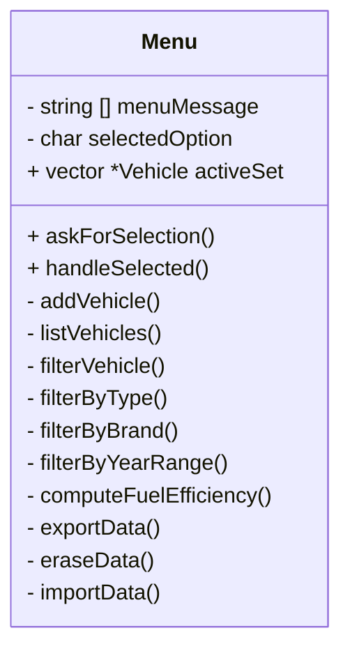
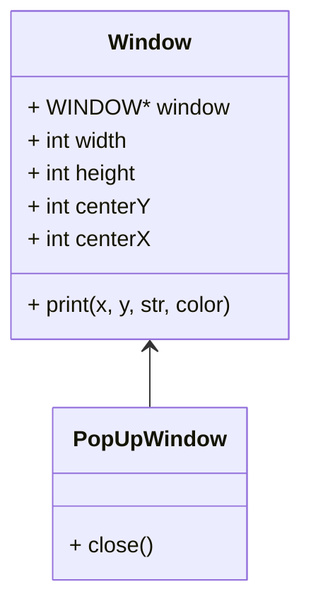
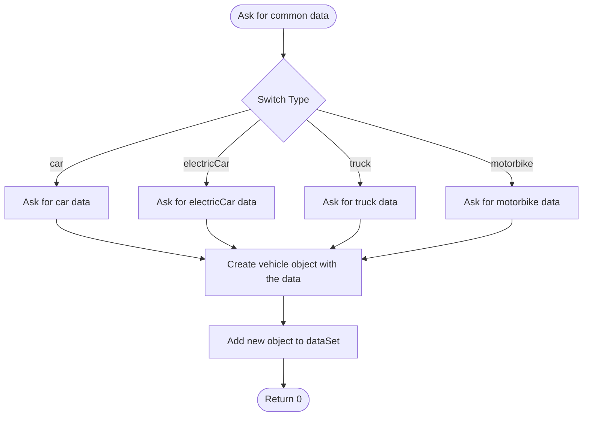
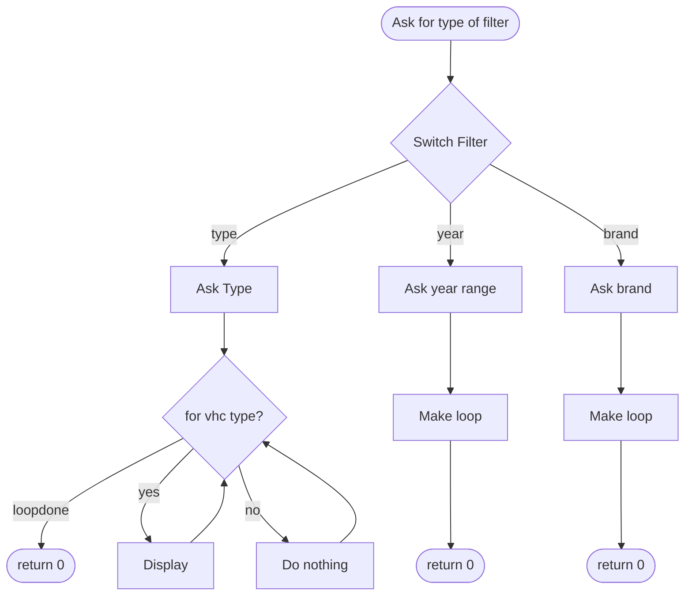
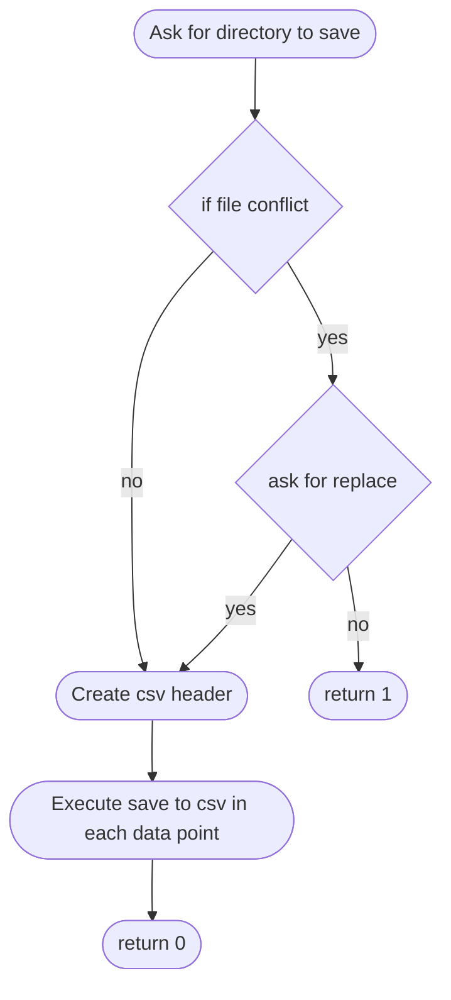

# Final project 

Create a C++ application that manages different types of vehicles (e.g., Car, Bike, Truck) using Object-Oriented Programming principles.
The system should allow users to add, list, sort, filter, and compute fuel efficiency for vehicles. 
Additionally, implement data persistence in textfile (csv) (saving/loading) and leverage modern C++ features like STL containers, and lambdas. Extra bonus: smart pointers

## Core Objectives - OOP Design

- Base Class:
- Vehicle
  - Common attributes: brand, model, year, fuelType, weight.
  - Common methods: info(), fuelEfficiency().
- Derived Classes:
  - Car, Bike, Truck...
    - Specialized attributes:
    - Car: numDoors, trunkCapacity, etc.
    - Bike: type (e.g., mountain, road), hasCarrier, etc.
    - Truck: payloadCapacity, numAxles, etc.
- Use virtual methods for info() and fuelEfficiency().
- Override methods: fuelEfficiency() and info() for each type.

More detail design later
   
## Data Management
  
Use std::map or std::unordered_set for indexing of vehicles by ID or brand.
Enums:
Define enums for fixed values like FuelType { Petrol, Diesel, Electric }.
Sample Data:
Preload a few vehicles for testing.

## Mandatory Actions

- Add Vehicle:
  - Prompt user for type and details.
  - Create appropriate derived object and store in the container.
- List Vehicles:
  - Display all vehicles using polymorphic info().
- Sort Vehicles:
  - Sort by fuelEfficiency or year using lambdas and std::sort.
- Filter Vehicles:
  - Filter by brand, fuel type, or year (and/or year range) using STL algorithms.
-  Compute Fuel Efficiency:
  - Each derived class implements its own formula.
- Save/Load Data:
  - Save vehicle list to a file (e.g., CSV).
  - Load data back into memory.
- Search by ID or Brand (optional):
  - Implement quick lookup using std::map.
- Each methods must to have Exception Handling:
  - Handle invalid input.

## Class diagram



This will be the four different type of classes, they will all have and info and fuel efficiency method. Info will display the data on the cli, fuel efficiency will calculate the fuel efficiency and save it. Fuel efficiency on gasoline and diesel cars will be calculated in l/100 km, on electric in miles per charge hour.

### Data

In order to handle the data a data class will be create, this will store shared pointers to all the vehicle class instances using a vector.
The data class will have the methods to import data from files and export it to files.



### Menu - CLI

All the code to handle the menu will be encapsulated in a menu class to organise the code.



The method on this class will be responsible of asking for the input from the user and call the necessary methods.

### TUI - Ncurses (Later)




## Class details

Details on the necessary methods

### Menu

Menu is the class that handle UI on the cli mode. Two methods one ask for a letter to select and operation from the user the other runs the operation. All menu messages are stored in const string, in the future this can be loaded from text adding multilanguage support.

This are the options to be selected by the user, all of them are coded by letter.

| Letter | Action |
| --- | --- |
| A | Add vehicles |
| F | Filter vehicles |
| L | List all vehicles |
| C | Calculate fuel efficiency |
| X | Export data |
| E | Erase data |
| I | Import data |

#### Add vechile



Each time user inputs data check validity and throw exception if invalid

#### Filter vehicle



#### List all vehicles

Loop through the entire dataset vector executing info method for each datapoint.

#### Calculate Fuel efficiency


#### Export data



#### Erase data

Loop through data set delete each object from memory and removing it from the data set vector

#### Import data

```mermaid
flowchart TD
A(["Ask for directory to load"])
B["throw and exception if no file"]
C{"for each line in csv"}
D["check type"]
E["check valid data"]
F["create object of type with data"]
G["add object to data set"]

A --> B
B --> C
C --> D 
D --> E
E --> F
F --> G
G --> C
