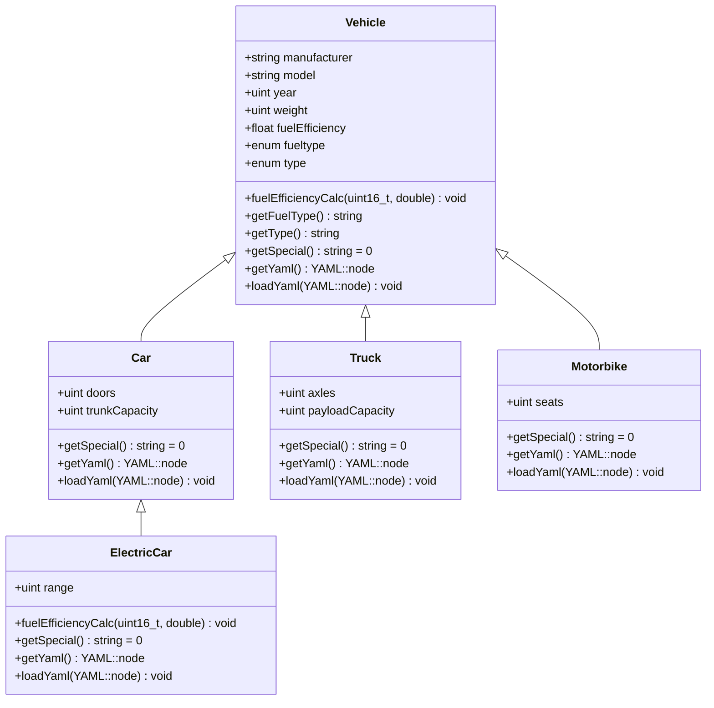
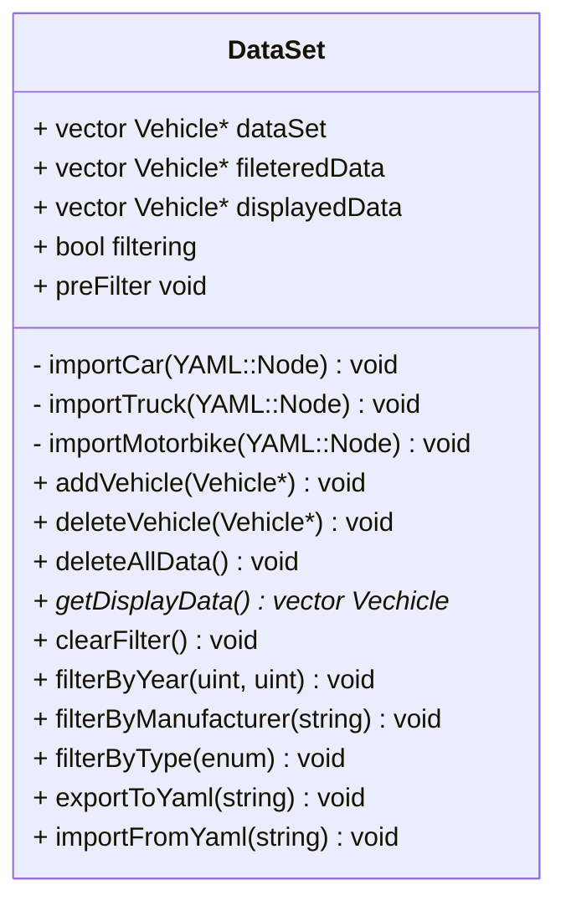
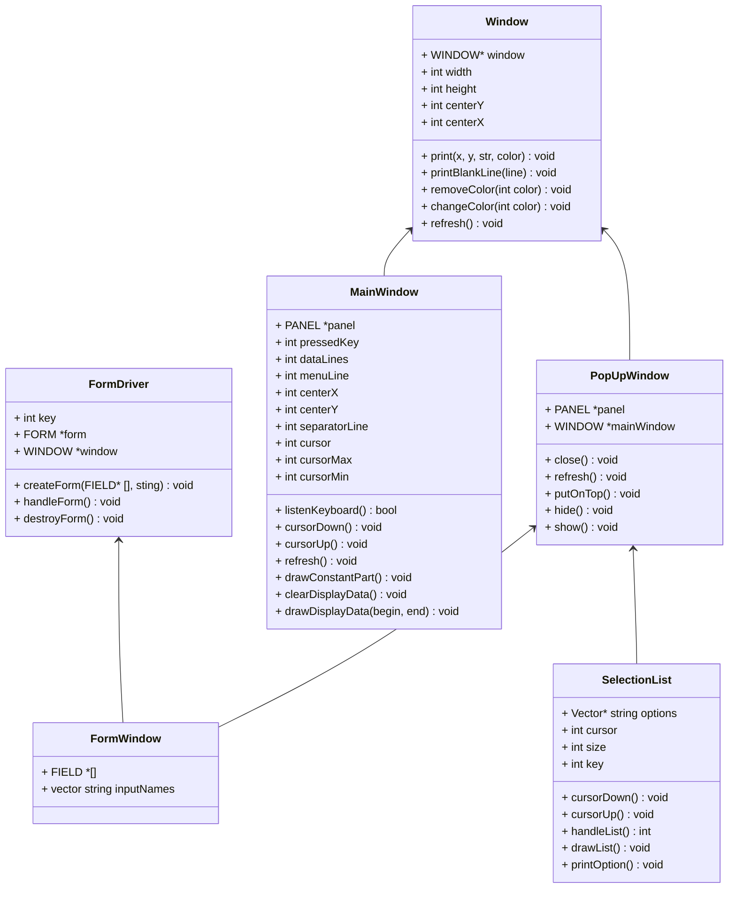

# Final project 

Create a C++ application that manages different types of vehicles (e.g., Car, Bike, Truck) using Object-Oriented Programming principles.
The system should allow users to add, list, sort, filter, and compute fuel efficiency for vehicles. 
Additionally, implement data persistence in textfile (csv) (saving/loading) and leverage modern C++ features like STL containers, and lambdas. Extra bonus: smart pointers

## Core Objectives - OOP Design

- Base Class:
- Vehicle
  - Common attributes: brand, model, year, fuelType, weight.
  - Common methods: info(), fuelEfficiency().
- Derived Classes:
  - Car, Bike, Truck...
    - Specialized attributes:
    - Car: numDoors, trunkCapacity, etc.
    - Bike: type (e.g., mountain, road), hasCarrier, etc.
    - Truck: payloadCapacity, numAxles, etc.
- Use virtual methods for info() and fuelEfficiency().
- Override methods: fuelEfficiency() and info() for each type.

More detail design later
   
## Data Management
  
Use std::map or std::unordered_set for indexing of vehicles by ID or brand.
Enums:
Define enums for fixed values like FuelType { Petrol, Diesel, Electric }.
Sample Data:
Preload a few vehicles for testing.

## Mandatory Actions

- Add Vehicle:
  - Prompt user for type and details.
  - Create appropriate derived object and store in the container.
- List Vehicles:
  - Display all vehicles using polymorphic info().
- Sort Vehicles:
  - Sort by fuelEfficiency or year using lambdas and std::sort.
- Filter Vehicles:
  - Filter by brand, fuel type, or year (and/or year range) using STL algorithms.
-  Compute Fuel Efficiency:
  - Each derived class implements its own formula.
- Save/Load Data:
  - Save vehicle list to a file (e.g., CSV).
  - Load data back into memory.
- Search by ID or Brand (optional):
  - Implement quick lookup using std::map.
- Each methods must to have Exception Handling:
  - Handle invalid input.

## Class diagram

This will be the four different type of classes, they will all have and info and fuel efficiency method. Info will display the data on the cli, fuel efficiency will calculate the fuel efficiency and save it. Fuel efficiency on gasoline and diesel cars will be calculated in l/100 km, on electric in miles per charge hour.

### Data

In order to handle the data a data class will be create, this will store shared pointers to all the vehicle class instances using a vector.

### TUI - Ncurses

All of the following classes will inherit from FromWindow, and will be use to get inputs form the user. If the data is impcomplete or wrongly formatted will get an error.

- AddCarWindow
- AddTruckWindow
- AddElectricWindow
- AddMotorbikeWindow
- YearWindow
- ManufacturerWindow
- PathWindow
- ElecFuelWindow
- fuelWindow

This classes are compose jsut by a contructor what sets up the fields, and a series of function that get the data from the form after saving by the user.
